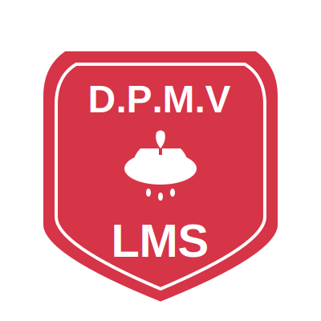

# D.P.M.V LMS Logo

A clean, scalable SVG logo design for D.P.M.V Learning Management System.

## Overview

This repository contains the official logo for D.P.M.V LMS, featuring a traditional shield design with an oil lamp symbol representing knowledge and learning. The logo is created as a scalable vector graphic (SVG) for optimal quality across all platforms and devices.

## Design Elements

- **Shield Shape**: Classic heraldic shield representing protection and trust
- **Oil Lamp**: Traditional symbol of knowledge, wisdom, and enlightenment
- **Color Scheme**: 
  - Primary: Red (#d63447)
  - Secondary: White (#ffffff)
- **Typography**: Bold, clean sans-serif for maximum readability
- **Drops**: Decorative elements below the lamp symbolizing the flow of knowledge

## Files Included

- `logo.svg` - Main logo file in SVG format
- `README.md` - This documentation file

## Usage Guidelines

### Recommended Applications
- Website headers and footers
- Learning management system interface
- Educational materials and documentation
- Print materials (letterheads, certificates, etc.)
- Mobile applications
- Social media profiles

### Technical Specifications
- **Format**: SVG (Scalable Vector Graphics)
- **Viewbox**: 400x400 units
- **Scalability**: Infinitely scalable without quality loss
- **Browser Support**: All modern browsers
- **File Size**: Optimized for web use

## Implementation

### HTML
```html

```

### CSS
```css
.logo {
    width: 200px;
    height: 200px;
    background-image: url('logo.svg');
    background-size: contain;
    background-repeat: no-repeat;
}
```

### Direct SVG Embed
Copy the SVG code directly into your HTML for maximum customization and performance.

## Customization

The logo can be easily customized by modifying the SVG code:

- **Colors**: Change the `fill` attributes
- **Size**: Modify the `viewBox` or use CSS sizing
- **Text**: Update the text content within `<text>` elements
- **Effects**: Add filters, shadows, or animations as needed

## Brand Guidelines

### Do's
- Maintain aspect ratio when scaling
- Use on contrasting backgrounds for visibility
- Ensure minimum size of 32px for digital use
- Keep adequate white space around the logo

### Don'ts
- Don't distort or stretch the logo
- Don't change the color scheme without approval
- Don't use on backgrounds that reduce readability
- Don't modify the core design elements

## License

This logo design is created for D.P.M.V LMS. Please ensure proper usage rights before implementation.

## Creator

**Designed by**: hexlorddev  
**Created**: 2025  
**Version**: 1.0

## Support

For questions, modifications, or technical support regarding this logo, please contact the development team.

---

*This logo represents the values of education, knowledge sharing, and academic excellence that D.P.M.V LMS stands for.*
